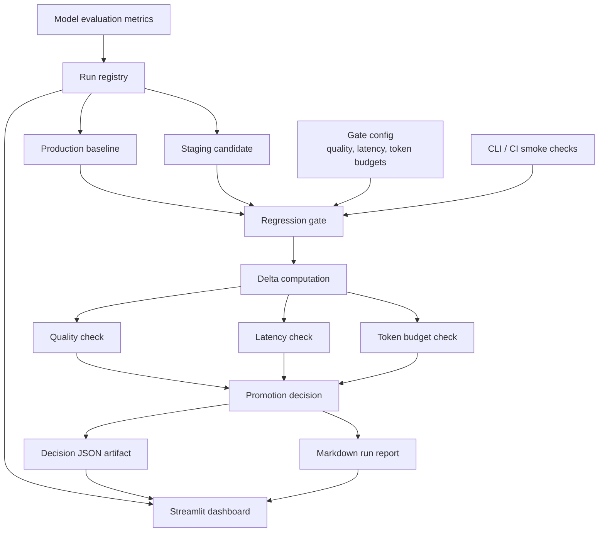

# LLMOps Experiment Tracker and Regression Gate


Repository: `https://github.com/msa-1988/llmops-experiment-tracker-and-regression-gate`

LLM releases should not be promoted because a demo "looks good." This project implements a compact LLMOps control plane that registers model runs, compares candidates against a production baseline, blocks regressions, and produces a reviewable promotion report.

## 10-Second Summary

| Contribution | Result |
| --- | --- |
| Production-style run registry | Every baseline and candidate run is stored as structured JSON with metrics, metadata, and stage. |
| Regression gate | Candidate promotion is blocked when quality, latency, or token-budget thresholds are violated. |
| Review dashboard | Streamlit surfaces leaderboard, quality/latency frontier, gate decision, and report context. |
| CI-ready workflow | Smoke tests and regression scripts make promotion checks repeatable from command line or CI. |

## Results At A Glance

The seeded benchmark tracks scientific-summary model candidates with quality, latency, and generated-token budgets.

| Run | Stage | ROUGE-L | Mean latency | Mean generated tokens | Gate result |
| --- | --- | ---: | ---: | ---: | --- |
| `baseline-qwen25-base` | `production` | `0.2963` | `0.6384s` | `35.87` | reference |
| `candidate-qwen25-qlora-v1` | `staging` | `0.3432` | `0.7543s` | `25.27` | pass |
| `candidate-qlora-optimized` | `staging` | `0.3514` | `0.7020s` | `23.80` | pass |
| `candidate-qlora-regressed` | `staging` | `0.2810` | `0.8910s` | `41.20` | fail |

Default promotion thresholds:

- quality regression: `ROUGE-L` must not drop by more than `0.005`
- latency budget: mean latency increase must stay within `0.20s`
- output budget: mean generated tokens must not increase by more than `5`

## Interface Preview

### Run Leaderboard And Gate Status


### Quality / Latency Frontier


### Promotion Decision Pipeline


## Core Idea

The project treats model promotion as an engineering decision:

1. register baseline and candidate runs
2. compare candidate behavior against the production baseline
3. evaluate explicit quality, latency, and token-budget gates
4. save the decision as a machine-readable artifact
5. export a human-readable run report
6. review the result in a dashboard

This keeps release decisions auditable, repeatable, and grounded in metrics rather than ad hoc qualitative judgment.

## Pipeline Diagram



## What The System Implements

- local run registry for structured model metadata and metrics
- baseline-vs-candidate comparison
- configurable regression thresholds in YAML
- pass/fail model-promotion gate
- distributed evaluation practice with `torchrun` for Kaggle T4x2
- markdown report generation for release review
- Streamlit dashboard for leaderboard, trade-off analysis, and gate inspection
- Docker and `docker-compose` packaging
- GitHub Actions workflow for repeatable validation

## Kaggle Multi-GPU Practice

This project uses multi-GPU compute for the LLMOps step that most often needs scale: **candidate evaluation**. The Kaggle workflow shards a synthetic LLM evaluation set across two GPU workers, aggregates quality/latency/token metrics with `torch.distributed`, registers one candidate run, and applies the same promotion gate used locally and in CI.

Notebook:

```text
notebooks/kaggle_2gpu_llmops_eval.ipynb
```

Command-line path on Kaggle T4x2:

```bash
git clone https://github.com/msa-1988/llmops-experiment-tracker-and-regression-gate.git
cd llmops-experiment-tracker-and-regression-gate
pip install -q streamlit pandas matplotlib PyYAML
bash scripts/run_kaggle_2gpu_eval.sh
```

Expected proof points:

- `world_size: 2`
- rank 0 writes `artifacts/runs/candidate-kaggle-ddp-eval.json`
- the regression gate writes `artifacts/gate_decisions/candidate-kaggle-ddp-eval_vs_baseline-qwen25-base.json`
- the review report is exported to `artifacts/kaggle_ddp_run_report.md`

## Example Promotion Report

The generated report summarizes the baseline, candidate, metric deltas, and final gate decision. A failed candidate remains visible in the dashboard, which is useful for diagnosing whether the regression came from quality, latency, or output-length behavior.

Generated artifacts:

- `artifacts/runs/*.json`
- `artifacts/gate_decisions/*.json`
- `artifacts/run_report.md`
- `screenshots/*.png`

## Local Run

### 1. Environment

```bash
python3 -m venv .venv
source .venv/bin/activate
pip install -r requirements.txt
```

### 2. Bootstrap example runs

```bash
python scripts/bootstrap_demo_runs.py
```

### 3. Run the regression gate

```bash
python scripts/check_regressions.py \
  --baseline baseline-qwen25-base \
  --candidate candidate-qwen25-qlora-v1
```

### 4. Export a promotion report

```bash
python scripts/export_run_report.py \
  --baseline baseline-qwen25-base \
  --candidate candidate-qwen25-qlora-v1
```

### 5. Launch the dashboard

```bash
./scripts/run_local.sh
```

Open `http://localhost:8504`.

## Validation

```bash
python scripts/smoke_test.py
```

Regenerate README visuals:

```bash
python scripts/generate_readme_visuals.py
```

## Project Layout

```text
.
├── app/
│   ├── streamlit_app.py
│   └── src/
├── artifacts/
│   ├── gate_decisions/
│   └── runs/
├── config/
│   └── regression_gate.yaml
├── docs/
├── screenshots/
├── scripts/
├── .github/workflows/
├── Dockerfile
├── docker-compose.yml
├── README.md
└── requirements.txt
```

## Why This Matters

LLM applications need release discipline. A candidate model can improve one quality metric while becoming slower, more verbose, or less reliable. This project demonstrates a practical model-promotion workflow where quality, cost, and latency are reviewed together before deployment.
