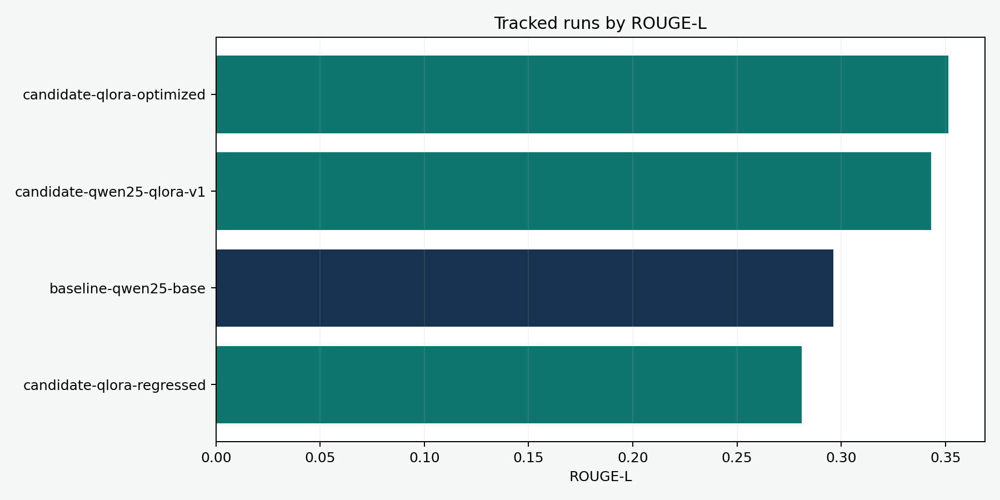
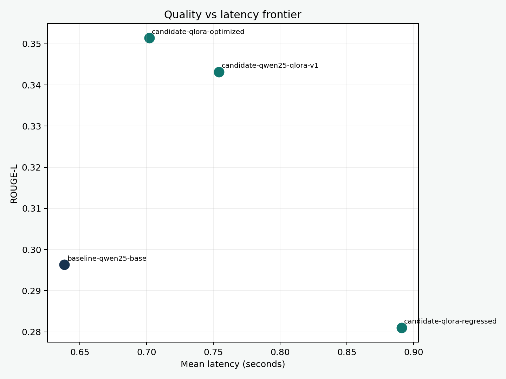
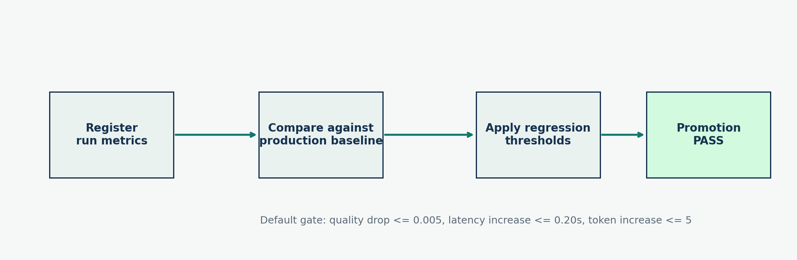
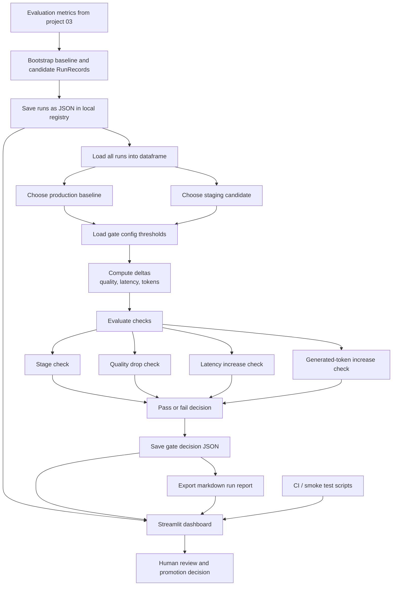

# LLMOps Experiment Tracker and Regression Gate

Repository: `https://github.com/msa-1988/llmops-experiment-tracker-and-regression-gate`

This repot builds a compact `MLOps / LLMOps` control plane for model experimentation, evaluation, deployment gating, and interview-friendly observability.

This project turns the outputs of the earlier `Scientific TLDR LLM Studio` into a production-style workflow:

- register every run with metadata and metrics
- compare candidate runs against a deployment baseline
- block promotions when quality regresses or latency budgets are violated
- generate human-readable reports for reviews
- surface everything in a lightweight `Streamlit` dashboard

The goal is not to clone a full platform like MLflow or W\&B. The goal is to show that the core `MLOps` ideas and build a clean, reviewable implementation from scratch.

## What This Project Shows

- experiment tracking for LLM fine-tuning runs
- deployment gating with explicit quality / latency thresholds
- CI-friendly regression checks
- promotion decisions grounded in metrics, not intuition
- dashboarding for MLOps review workflows
- Azure-ready packaging patterns through container + config assets

## Interface Preview

### Run leaderboard and gates



### Quality vs latency trade-off



### Promotion pipeline



## Pipeline Diagram



## Validation Snapshot

The project bootstraps its initial runs from the real metrics produced by:

- `03 - Fine-Tune and Optimize a Small Domain LLM`

Current seeded baseline and candidate results:

| Run | Stage | ROUGE-L | Mean latency (s) | Gate result |
| --- | --- | ---: | ---: | --- |
| `baseline-qwen25-base` | `production` | `0.2963` | `0.6384` | reference |
| `candidate-qwen25-qlora-v1` | `staging` | `0.3432` | `0.7543` | `pass` |
| `candidate-qlora-optimized` | `staging` | `0.3514` | `0.7020` | `pass` |
| `candidate-qlora-regressed` | `staging` | `0.2810` | `0.8910` | `fail` |

Default promotion rules:

- `ROUGE-L` must not drop by more than `0.005`
- mean latency increase must stay within `0.20s`
- mean generated tokens must not grow by more than `5`

## Workflow

1. Register a baseline run
2. Add candidate fine-tuning or inference runs
3. Compare candidates against the current production baseline
4. Apply explicit regression gates
5. Export a deployment report
6. Review the outcome in the dashboard

## Local Run

### 1. Environment

```bash
python3 -m venv .venv
source .venv/bin/activate
pip install -r requirements.txt
```

### 2. Bootstrap the demo runs

```bash
python scripts/bootstrap_demo_runs.py
```

### 3. Run the regression gate

```bash
python scripts/check_regressions.py --baseline baseline-qwen25-base --candidate candidate-qwen25-qlora-v1
```

### 4. Export a markdown report

```bash
python scripts/export_run_report.py --baseline baseline-qwen25-base --candidate candidate-qwen25-qlora-v1
```

### 5. Generate README visuals

```bash
python scripts/generate_readme_visuals.py
```

### 6. Launch the dashboard

```bash
./scripts/run_local.sh
```

Open `http://localhost:8504`

## Validation

Fast sanity check:

```bash
python scripts/smoke_test.py
```

## Expected Artifacts

The project writes:

- `artifacts/runs/*.json`
- `artifacts/gate_decisions/*.json`
- `artifacts/run_report.md`
- `screenshots/*.png`

## Project Layout

```text
.
├── app/
│   ├── streamlit_app.py
│   └── src/
├── artifacts/
│   ├── gate_decisions/
│   └── runs/
├── config/
├── docs/
├── screenshots/
├── scripts/
├── .github/workflows/
├── .streamlit/
├── Dockerfile
├── docker-compose.yml
├── README.md
└── requirements.txt
```

## Notes

- This project uses real metrics from the earlier summarization fine-tuning pipeline to seed the first production and staging runs.
- The implementation is intentionally lightweight and transparent so it is easy to explain in interviews.
- The same control-plane ideas extend naturally to larger systems using MLflow, W\&B, Azure ML, or internal platforms.
